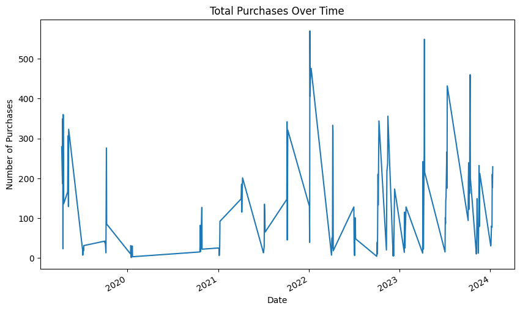
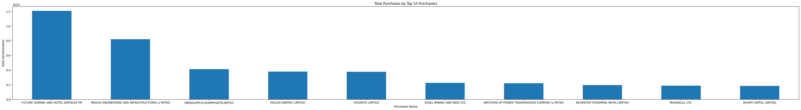
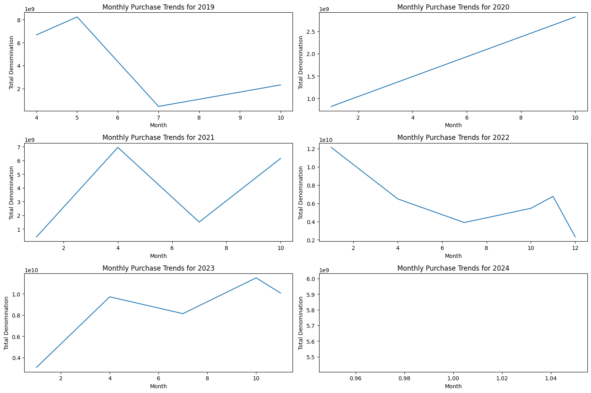
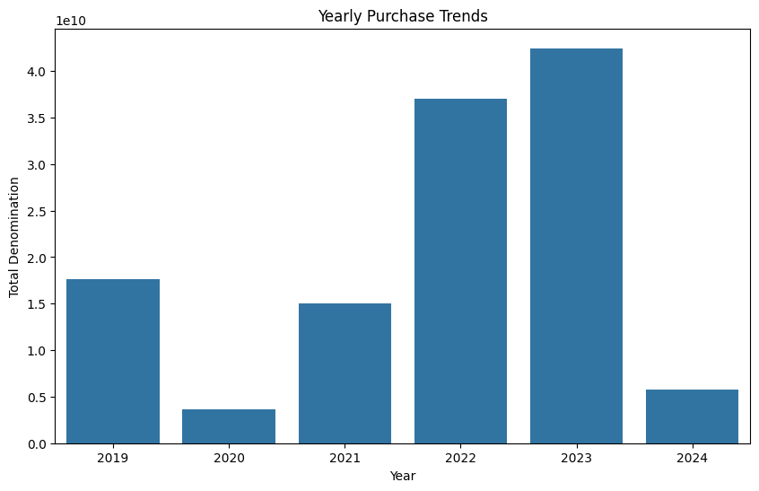
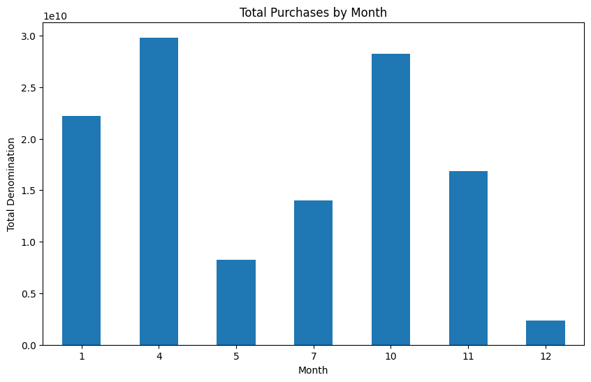
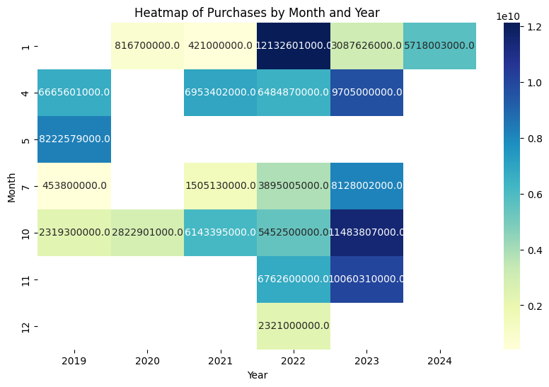

# Electoral Bonds Data Analysis

-----

## Problem Statement

The problem statement revolves around **analyzing purchasing behavior** based on a dataset containing information about **date of purchase**, **purchaser names**, **denomination**, **Year**, and **Month**. The objective is to **gain insights** into various aspects of purchasing patterns through **data visualization** using **matplotlib** and **seaborn**.
This includes exploring **total purchases over time** to identify trends, examining the **distribution of denominations** purchased, comparing **total purchases by purchaser** to identify key customers, analyzing **monthly and yearly purchase trends** to discern any seasonal or annual patterns, and investigating the **relationship** between **numerical variables** such as denomination, year, and month through a **pairplot**.
These analyses aim to provide a comprehensive understanding of purchasing dynamics, aiding in strategic decision-making and optimization of sales strategies.

-----

## Identify the Data

[Dataset](https://github.com/Tanay-Dwivedi/Electoral-Bonds-Data-Analysis/blob/master/electroral_bonds_buyer_data.csv)

The dataset comprises records detailing **transactions**, including **date of purchase**, **purchaser names**, and **denomination**, as well as temporal information such as **Year** and **Month**. The objective is to glean insights into purchasing behavior and trends through comprehensive analysis and visualization techniques.

-----

## Results & Inference

### Total Purchases Over Time:

**Aim:** To visualize the trend of total purchases made over time.

**Observation:** This plot helps in understanding the overall pattern of purchases over the entire period covered by the dataset.

### Distribution of Denominations:

**Aim:** To explore the distribution of denominations purchased.

**Observation:** This histogram shows the frequency distribution of denominations, giving insights into the most common denomination ranges.

### Monthly Purchase Trends:

**Aim:** To observe the trend of purchases over different months.

**Observation:** This line plot helps in identifying any seasonal patterns or trends in purchases over the months.

### Yearly Purchase Trends:

**Aim:** To analyze the trend of purchases over different years.

**Observation:** This bar plot provides insights into the overall trend of purchases year by year, highlighting any significant changes or growth.

### Total Purchases by Month:

**Aim:** To compare the total purchases made in each month.

**Observation:** This bar plot allows us to identify the months with the highest and lowest total purchases.

### Heatmap of Purchases by Month and Year:

**Aim:** To explore the total purchases made in each month for each year.

**Observation:** This heatmap provides a visual representation of how purchases vary across different months and years.

-----

## Conclusion

In conclusion, the analysis of the dataset has provided valuable insights into purchasing behavior and trends over time. Through visualizations such as line plots, bar plots, and box plots, we were able to identify patterns, distributions, and relationships within the data.
Key findings include seasonal fluctuations in purchases, variations in denomination distribution among purchasers, and notable trends in total purchases across different months and years. These insights can inform strategic decision-making processes, aiding businesses in optimizing their sales strategies, targeting key customers, and adapting to changing market dynamics effectively.

-----

## Recommendations

1. **Seasonal Promotions:** Launch targeted promotions during high-purchasing months to boost sales.
2. **VIP Customer Rewards:** Offer personalized rewards or discounts to high-spending customers to foster loyalty.
3. **Price Adjustment:** Adjust pricing for products based on popular denomination ranges to enhance competitiveness.
4. **Inventory Optimization:** Optimize inventory levels based on monthly and yearly purchase trends to minimize stockouts and excess inventory.
5. **Data-Driven Marketing:** Utilize insights from purchase patterns to tailor marketing campaigns and product offerings for improved customer engagement and conversion rates.

-----